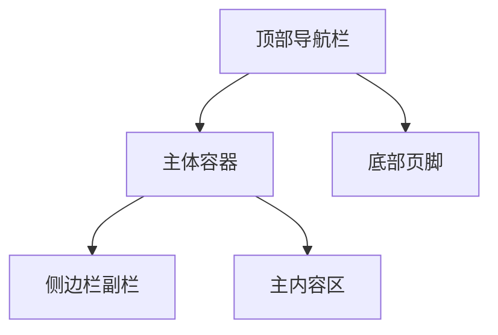
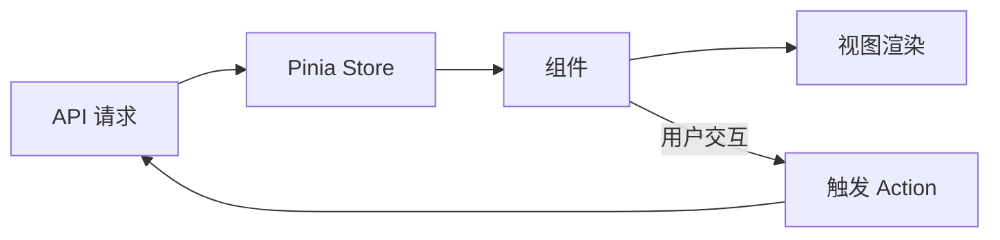

# bluore在线状态监控前端项目文档

## 1. 项目概述

### 1.1 项目简介
本项目是一个用于监控网站管理员（bluore）实时活动状态的前端应用。通过直观的界面展示bluore当前在做什么、在线设备（电脑/手机）以及历史活动记录，方便访客了解bluore动态。

### 1.2 目标用户
- 网站访客：希望了解bluore是否在线、正在做什么。
- bluore本人：查看自己的活动历史。

### 1.3 核心价值
- **实时性**：显示bluore当前活动，减少信息滞后。
- **透明度**：让访客感知bluore的存在与忙碌程度。
- **历史追溯**：提供最近1天的活动记录，便于回顾。

### 1.4 项目名称与版本
- 项目名称：`Webmaster Activity Dashboard`
- 版本：`v1.0.0`
- 框架：Vue 3 (Composition API)

## 2. 功能需求详细描述

### 2.1 首页（Dashboard）
- **显示内容**：
  - bluore头像、昵称、基本联系方式（邮箱、社交链接）。
  - 当前活动描述（例如：“正在写代码”、“正在看电影”）。
  - 设备在线状态：
    - 如果电脑在线：主栏显示“电脑在线”及详情（如IP、持续时间），副栏（侧边栏）显示手机的在线情况。
    - 如果电脑不在线但手机在线：主栏显示手机的在线详情，不显示电脑。
    - 如果两者均离线：显示“bluore离线”及最后离线时间。
  - 实时更新时间戳（每30秒自动刷新）。

### 2.2 历史记录页面（History）
- **时间范围**：最近24小时（1天）的活动记录。
- **设备分离**：将手机和电脑的记录分开显示为两个独立列表。
- **排序**：每个列表按时间倒序排列（最新在前）。
- **每条记录包含**：
  - 设备类型（手机/电脑）
  - 活动描述
  - 开始时间与持续时间
  - 在线状态（在线/离线）

### 2.3 关于页面（About）
- **杂项内容**：
  - 项目介绍、技术栈说明。
  - bluore个人简介、兴趣爱好。
  - 更新日志、版本历史。
  - 其他任意内容（如友情链接、捐赠信息）。

### 2.4 状态显示逻辑（业务规则）
1. 获取实时状态 API 返回 `{ computer: { online: boolean, activity: string, ... }, phone: { ... } }`。
2. 判断：
   - 若 `computer.online` 为真：主栏显示电脑状态，副栏显示手机状态（无论手机是否在线）。
   - 若 `computer.online` 为假且 `phone.online` 为真：主栏显示手机状态，副栏隐藏或显示提示“电脑离线”。
   - 若两者均离线：主栏显示离线信息，副栏可隐藏或显示历史摘要。

## 3. 页面结构设计

### 3.1 整体布局
采用经典的“侧边栏+主内容”布局，顶部导航栏，底部页脚。



### 3.2 首页布局
```
+---------------------------------------+
|           顶部导航栏 (Logo + 菜单)     |
+-------------------+-------------------+
|  主内容区          |   侧边栏副栏       |
|  (设备状态详情)    |  (另一设备状态/    |
|                   |   联系方式)        |
+-------------------+-------------------+
|           底部页脚 (版权信息)          |
+---------------------------------------+
```

### 3.3 历史记录页面布局
- 顶部为标题“历史记录”。
- 两个选项卡（Tabs）：`手机记录` 和 `电脑记录`，点击切换显示对应列表。
- 每个列表为卡片式时间线。

### 3.4 关于页面布局
- 自由格式，可包含多个章节（Section），每章节一个卡片。

## 4. 组件设计

### 4.1 全局组件
- `AppHeader`：顶部导航栏，包含 Logo 和页面链接。
- `AppFooter`：底部页脚。

### 4.2 首页组件
- `StatusDashboard`：首页主容器。
  - `AvatarCard`：头像、昵称、联系方式。
  - `DeviceStatusCard`：设备状态卡片（可复用）。
  - `ActivityDescription`：当前活动描述。
  - `LiveTimer`：实时刷新计时器。

### 4.3 历史页面组件
- `HistoryPage`：历史记录页面容器。
  - `DeviceTabs`：选项卡切换。
  - `HistoryList`：历史列表（按设备过滤）。
  - `HistoryItem`：单条历史记录卡片。

### 4.4 关于页面组件
- `AboutPage`：关于页面容器。
  - `SectionCard`：通用章节卡片。

### 4.5 共享组件
- `LoadingSpinner`：加载动画。
- `ErrorAlert`：错误提示。
- `EmptyState`：空状态提示。

### 4.6 组件 Props 示例（以 DeviceStatusCard 为例）
```javascript
// DeviceStatusCard.vue
props: {
  device: { type: String, required: true }, // 'computer' | 'phone'
  online: { type: Boolean, required: true },
  activity: { type: String, default: '' },
  lastSeen: { type: String, default: '' },
  details: { type: Object, default: () => ({}) }
}
```

## 5. 数据流设计

### 5.1 状态管理
使用 **Pinia**（Vue 官方推荐的状态管理库）存储全局状态。

**Store 模块**：
- `userStore`：bluore基本信息（头像、昵称、联系方式）。
- `statusStore`：实时状态（电脑、手机在线状态及活动）。
- `historyStore`：历史记录列表。

### 5.2 API 接口定义（假设后端提供）
| 端点 | 方法 | 描述 | 响应格式 |
|------|------|------|----------|
| `/api/status` | GET | 获取当前实时状态 | `{ computer: DeviceStatus, phone: DeviceStatus }` |
| `/api/history` | GET | 获取最近24小时历史 | `{ computer: HistoryItem[], phone: HistoryItem[] }` |
| `/api/profile` | GET | 获取bluore个人信息 | `{ name, avatar, email, socialLinks }` |

**数据模型**：
```typescript
interface DeviceStatus {
  online: boolean;
  activity: string;
  lastUpdated: string; // ISO 8601
  ip?: string;
  duration?: number; // 秒
}

interface HistoryItem {
  id: string;
  device: 'computer' | 'phone';
  activity: string;
  startTime: string;
  endTime?: string;
  online: boolean;
}
```

### 5.3 数据流图


## 6. 技术栈选择

### 6.1 核心框架
- **Vue 3**：使用 Composition API 和 `<script setup>` 语法。
- **Vite**：构建工具，提供快速的开发服务器和打包。

### 6.2 UI 组件库
- **Element Plus**：基于 Vue 3 的桌面端 UI 库，提供丰富的组件。
- 备选：**Vuetify**（Material Design 风格）或 **Ant Design Vue**。

### 6.3 样式方案
- **SCSS**：预处理器，便于维护变量、混合、嵌套。
- **CSS 变量**：主题色、间距等设计令牌。

### 6.4 工具库
- **Axios**：HTTP 客户端。
- **Day.js**：轻量级日期处理。
- **Vue Router**：路由管理。
- **Pinia**：状态管理。
- **ESLint + Prettier**：代码规范与格式化。

### 6.5 开发环境
- Node.js 18+
- npm / yarn / pnpm

## 7. 项目结构（目录树）

```
src/
├── assets/           # 静态资源（图片、字体）
├── components/       # 可复用组件
│   ├── common/       # 全局通用组件
│   ├── dashboard/    # 首页相关组件
│   ├── history/      # 历史页面组件
│   └── about/        # 关于页面组件
├── composables/      # 组合式函数
├── stores/           # Pinia store
│   ├── userStore.ts
│   ├── statusStore.ts
│   └── historyStore.ts
├── router/           # 路由配置
├── services/         # API 服务层
│   ├── api.ts
│   └── types.ts
├── styles/           # 全局样式
│   ├── variables.scss
│   └── global.scss
├── views/            # 页面级组件
│   ├── Dashboard.vue
│   ├── History.vue
│   └── About.vue
├── App.vue
└── main.ts
```

## 8. API 接口详细定义

**务必阅读接口文档**

> 本地临时接口地址为http://127.0.0.1:11451/api/v1/

### 8.1 获取实时状态
**GET** `/api/status`

响应示例：
```json
{
    "code": 200,
    "message": "成功",
    "data": {
        "device_list": [
            {
                "device": "phone",
                "application": "没有相关记录",
                "start_time": "0001-01-01T00:00:00Z",
                "update_time": "0001-01-01T00:00:00Z"
            },
            {
                "device": "computer",
                "application": "asdf",
                "start_time": "2026-01-13T02:25:00+08:00",
                "update_time": "2026-01-13T02:30:00+08:00"
            }
        ]
    }
}
```

### 8.2 获取历史记录
**GET** `/api/history?device=computer|phone&limit=50`

响应示例：
```json
{
    "code": 200,
    "message": "成功",
    "data": {
        "list": [
            {
                "device_name": "phone",
                "record": [
                    {
                        "device": "phone",
                        "application": "wechat",
                        "start_time": "2026-01-11T20:22:00+08:00",
                        "update_time": "2026-01-11T20:27:00+08:00"
                    }
                ]
            },
            {
                "device_name": "computer",
                "record": [
                    {
                        "device": "computer",
                        "application": "lol",
                        "start_time": "2026-01-11T20:25:00+08:00",
                        "update_time": "2026-01-11T20:30:00+08:00"
                    },
                    {
                        "device": "computer",
                        "application": "goland",
                        "start_time": "2026-01-11T20:15:00+08:00",
                        "update_time": "2026-01-11T20:20:00+08:00"
                    }
                ]
            }
        ]
    }
}
```

## 9. 样式设计指南

### 9.1 设计令牌（Design Tokens）
在 `styles/variables.scss` 中定义：
```scss
// 颜色
$primary-color: #3498db;
$secondary-color: #2ecc71;
$danger-color: #e74c3c;
$text-color: #333;
$bg-color: #f9f9f9;

// 间距
$spacing-unit: 8px;
$spacing-1: $spacing-unit; // 8px
$spacing-2: $spacing-unit * 2; // 16px

// 字体
$font-family: 'Segoe UI', 'Helvetica Neue', sans-serif;
$font-size-base: 14px;
```

### 9.2 组件样式规范
- 使用 BEM 命名约定（可选）。
- 卡片具有阴影、圆角、内边距。
- 设备状态颜色：
  - 在线：绿色边框
  - 离线：灰色边框

## 10. 部署说明

### 10.1 构建
```bash
npm run build
```
输出到 `dist/` 目录。

### 10.2 静态托管
- **Netlify**：拖拽 `dist` 文件夹至 Netlify 网站。
- **Vercel**：连接 Git 仓库自动部署。
- **GitHub Pages**：使用 `gh-pages` 分支。

### 10.3 环境变量
创建 `.env` 文件：
```
VITE_API_BASE_URL=https://api.yourdomain.com
VITE_APP_TITLE=bluore在线状态监控
```

### 10.4 持续集成（可选）
提供 GitHub Actions 配置示例。

## 11. 后续优化方向

1. **实时推送**：使用 WebSocket 替代轮询，实现更实时更新。
2. **多bluore支持**：扩展为团队监控面板。
3. **移动端适配**：优化响应式设计。
4. **国际化**：支持多语言。
5. **数据分析**：增加图表展示历史趋势。

---

*文档最后更新：2026-01-11*