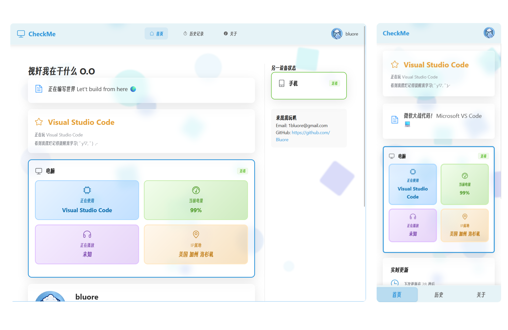

# CheckMe-Front

## 简介

`CheckMe-Front` 是 `CheckMe` 项目的前端应用，采用 **Vue 3** + **TypeScript** + **Vite** 构建，用于展示设备实时在线状态信息。本项目支持桌面端和移动端的响应式设计，提供设备电量、正在播放的多媒体、活动记录等实时数据的展示与交互。

> **相关地址**
> 
> [后端服务](https://github.com/Bluore/CheckMe)
> 
> [数据收集客户端 - 桌面端](https://github.com/Bluore/CheckMe-Client-Python)
> 
> [数据收集客户端 - 移动端](https://github.com/Bluore/CheckMe-Client-MKSH)

## 演示

示例网站：[https://me.bluore.top](https://me.bluore.top)



## 本地运行

### 前置要求

- Node.js >= 16.0
- npm 或 yarn 包管理器

### 安装与启动

1. **克隆项目**

```bash
git clone https://github.com/Bluore/CheckMe-Front.git
cd CheckMe-Front
```

2. **安装依赖**

```bash
npm install
# 或使用 yarn
yarn install
```

3. **启动开发服务器**

```bash
npm run dev
# 或使用 yarn
yarn dev
```

浏览器将自动打开 [http://localhost:5173](http://localhost:5173)

4. **构建生产版本**

```bash
npm run build
# 或使用 yarn
yarn build
```

构建输出到 `dist` 目录

5. **预览生产构建**

```bash
npm run preview
# 或使用 yarn
yarn preview
```

## 配置

### API 配置

编辑 `.env` 文件或在源代码中配置 API 端点和基础 URL，确保连接到正确的后端服务。

最小化配置示例：

```env
VITE_API_BASE_URL=http://localhost:8080/api/v1
```

默认 API 服务在 [src/services/api.ts](src/services/api.ts) 中配置。

## 路由说明

| 路径 | 视图 | 说明 |
|------|------|------|
| `/` | Dashboard | 桌面端仪表盘 |
| `/detail` | Detail | 设备详细信息 |
| `/history` | History | 活动历史记录 |
| `/mobile` | MobileDashboard | 移动端仪表盘 |

**自动重定向**：移动设备访问根路径时会自动重定向至 `/mobile`

## 相关项目

- [CheckMe 后端](https://github.com/Bluore/CheckMe) - Golang 后端服务
- [CheckMe-Client-Python](https://github.com/Bluore/CheckMe-Client-Python) - 桌面数据采集客户端
- [CheckMe-Client-MKSH](https://github.com/Bluore/CheckMe-Client-MKSH) - 移动端数据采集客户端
